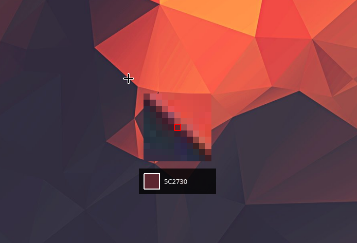
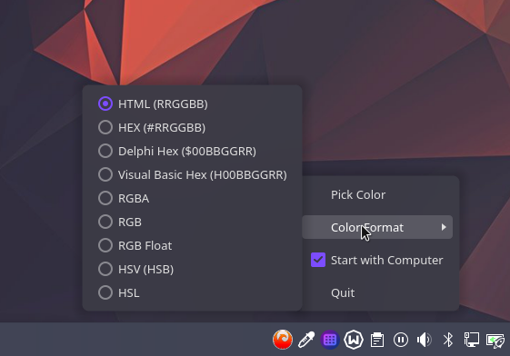

# Color Picker

A lightweight, feature-rich system tray color picker for Linux with multi-monitor support and multiple color format outputs.

> Inspired by [Instant Eyedropper](https://instant-eyedropper.com/)

## Screenshots

## Features

- **System Tray Integration** - Runs quietly in the background, accessible from the system tray
- **Multi-Monitor Support** - Works seamlessly across multiple displays
- **Real-time Magnifier** - 12x zoom magnifier follows your cursor for precise pixel selection
- **Multiple Color Formats** - Support for 9 different color format outputs:
  - HTML (`RRGGBB`)
  - HEX (`#RRGGBB`)
  - Delphi Hex (`$00BBGGRR`)
  - VB Hex (`&H00BBGGRR&`)
  - RGBA (`rgba(r, g, b, a)`)
  - RGB (`rgb(r, g, b)`)
  - RGB Float (`r.rrr, g.ggg, b.bbb`)
  - HSV (`hsv(h, s%, v%)`)
  - HSL (`hsl(h, s%, l%)`)
- **Automatic Clipboard Copy** - Selected colors are automatically copied to clipboard
- **Autostart Support** - Optional autostart on system boot
- **Cross-hair Cursor** - Precise pixel targeting with visual feedback
- **Color Preview** - Real-time color preview in the magnifier window

## Dependencies

- Spectacle (KDE screenshot utility) - for screen capture functionality

## Installation

Download the AppImage from the releases page

## Usage

1. Launch the application
2. The color picker icon will appear in your system tray
3. Right-click the tray icon to access options:
   - **Pick Color** - Activate the color picker
   - **Format** - Choose your preferred color format
   - **Start at Login** - Toggle autostart
   - **Quit** - Exit the application
4. When picking colors:
   - Move your cursor over any pixel on your screen
   - Use the magnifier to precisely target the desired color
   - Click to select the color (automatically copied to clipboard)
   - Press `Escape` to cancel

## Technical Details

- Built with Qt6 for modern Linux desktop environments
- Uses Spectacle for reliable multi-monitor screenshot capture on Wayland/X11
- Implements real-time pixel magnification with no smoothing for accurate color selection
- Efficient memory management with automatic cleanup

## License

[MIT License](LICENSE-MIT)

## Contributing

Contributions are welcome! Please feel free to submit pull requests or open issues.

## Known Requirements

- Spectacle must be installed for screenshot functionality to work
- System tray support must be available in your desktop environment
